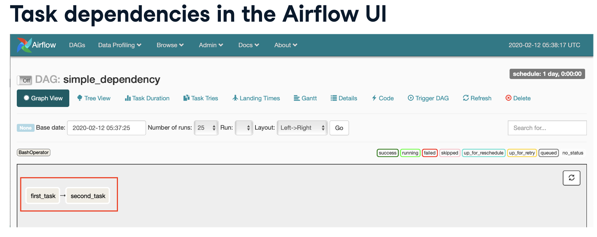
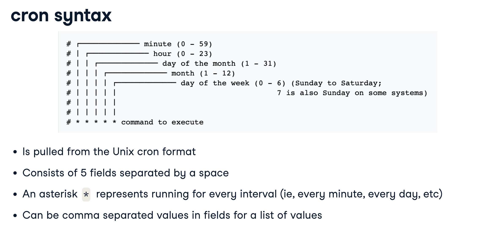

# Apache Airflow

A platform to program workflows, including creation, scheduling, monitoring such workflows. Can implement programs written in any language, but workflows are written in Python. Workflows are implemented as DAGs: _Directed Acyclic Graphs_. They are accessible via code, command-line, or via web-interface.

## Command-Line

All following the `airflow` shell command:

- `airflow list_dags`: lists DAGs part of the airflow system
- `airflow run <dag_id> <task_id> YYYY-MM-DD`: Run `task_id` from the DAG `dag_id`, with a start date (earliest date the dag can be run).
- `airflow scheduler`: Restart the scheduler, which can stop for various reasons preventing new tasks from being scheduled.
- `airflow webserver`: start a webserver. Use `-p` to specify port.

The command-line is best used to interact with Airflow to start processes, manually run DAGs or tasks within them, and get logging information. Python is best used to edit the DAGs themselves.s

## What is a DAG?

DAGs, or _Directed Acyclic Graphs_ are

- **Directed**: there is an inherent order to the flow representing dependencies between components.
- **Acyclic**: does not loop/cycle/repeat
- **Graphical**: components may be repesented by a graph

They are made up of components, and commonly have dependencies on prior steps (e.g., importing a file before uploading it to a database).

An example DAG:

```python
from airflow.models import DAG #Note case-sensitivity
from datetime import datetime

#The following are optional but recommended
dflt_args = {
	'owner': 'Kirkwood Donavin'
	'email': 'agentkirkwood@gmail.com'
	'start_date': datetime(2023, 1, 1)

etl_dag = DAG('etl_workflow', default_args=dflt_args)
}
```

## Operators

Represent a single task in a workflow that runs independently (usually). That means that  meaning all resources required to run the operator is contained within the script.

- `BashOperator()`: Run bash scripts. For example:
```python
from airflow.operators.bash_operator import BashOperator
BashOperator(
	task_id='bash_example', 
	bash_command='example.sh',
	dag=ml_dag)
```
Some gotchas: sometimes require extensive use of environmental variable to make operable. And, likewise user permissions can be difficult.
- `PythonOperator()`: Executes a Python function or callable. It can pass arguments to the Python code either positionally or using keyword args (using `op_kwargs`). An example:
```python
from airflow.operators.bash_operator import PythonOperator
def printme():
	print("This goes in the logs!")
def sleep(length_of_time):
	time.sleep(length_of_time)
sleep_task = PythonOperator(
	task_id='sleep'
	, python_callable=sleep
	, op_kwargs={'length_of_time': 5}
	, dag=example_dag)
```
- `EmailOperator()`: Sends an email! May contain email components like HTML content, attachments. Note: The system must be configured with email server details. An example:
```python
from airflow.operators.email_operator import EmailOperator
email_task = EmailOperator(
	task_id='email_sales_report'
	, to='sales_manager@example.com'
	, subject='Automated Sales Report'
	, html_content='Attached is the latest sales report'
	, files=['latest_sales.xlsx']
	, dag=example_dag)
```

### Tasks

Instantiated `Operator` objects assigned to a Python variable.

Note that Tasks are referred to by their `task_id` in Airflow tools, not the Python variable name.

_Task dependencies_ define a given order of task completion. Dependencies are not required but without them, Airflow determines order of execution with no guarantees of order. All dependencies are defined relative to one another as _upstream_ (`>>`) or _downstream_ (`<<`) tasks. 

```python
task1 = BashOperator(
	task_id='first_task', 
	bash_command='first_task.sh',
	dag=example_dag)

task2 = BashOperator(
	task_id='second_task', 
	bash_command='echo second task!',
	dag=example_dag)

#Set order of dependencies
task1 >> task2
```

In the Airflow UI, dependencies will be represented graphically.



### Sensor

An `Operator` that waits for a certain condition to be true. For example, the creation of a file, uploading of a record to a database, or a certain response from a web request. We can define how often to check that the condition is true. `Sensor` objects are instantiated as tasks as other `Operators`.

`Sensor` objects share some default attributes:

- `mode`: How to check for the condition. `mode='poke'`  the default, to run repeatedly and keep the task slot. `mode='reschedule` to give up the task slot and try again later.
- `poke_interval` (`mode='poke'` only): How often to wait between checks
- `timeout`: How long to wait before failing task

The `Sensor` objects also include normal operator attributes (e.g., `task_id`, `dag`).

`Sensor` tasks may be preferred over `Operator` tasks when: 

- Uncertainty over when a condition will be true
- Desiring repeated attempts prior to failure
- Create task repetition without loops

#### Sensor Types

- `FileSensor`: Checks for the existance of a file at a certain location (or whether _any_ files exist within a directory). An example:
```python
from airflow.contrib.sensors.file_sensor import FileSensor

file_sensor_task = FileSensor(
	task_id='file_sense'
	, filepath='salesdata.csv'
	, poke_interval=300
	, dag=sales_report_dag)

init_sales_cleanup >> file_sensor_task >> generate_report
```
- `ExternalTaskSensor`: Wait for a task in another DAG to complete
- `HttpSensor`: Request a web URL and check for content
- `SqlSensor`: Runs a SQL query to check for content

### Executors

Executors run tasks. 

- `SequentialExecutor`: The default execution engine for Airflow. It runs one task at a time, and this makes it simple to debug. However, it can be too slow for production jobs.
- `LocalExecutor`: Treats each task as a process on the local situation. It can start as many concurrent tasks as desired (and permitted by the resources of the local system). The _parallelism_ of the task may be defined by the user as unlimited, or limited to a certain number of tasks.
- `CeleryExecutor`: Celery is a general queuing system written in Python that allows multiple systems to communicate as a cluster. The `CeleryExecutor` is used to set _multiple_ Airflow systems can be configured as workers for a given set of workflows or tasks. It is more difficult to configure, and requires a working Celery system with a method for sharing DAGs. Yet, it can be very powerful for high processing needs and large numbers of DAGs.

The type of executor being used may be viewed in the `airflow.cfg` file, after `executor=`, or via `airflow list_dags` on the command line.

Sometimes DAG tasks will be held up in the executer as there are not enough free slots. This may be addressed by:

- Changing the executor type (e.g., `LocalExecutor`, `CeleryExecutor`)
- Adding system resources, or more systems
- Changing the DAG scheduling to something more efficient

### Branch Operators

Branching in Airflow provides conditional logic for running operators. A `BranchPythonOperator` example:

```python
def branch_test(**kwargs):
	if int(kwargs['ds_nodash']) % 2 == 0:
		return 'even_day_task'
	else:
		return 'odd_day_task'

branch_test = BranchPythonOperator(
	task_id='branch_test'
	, dag=dag
	, provide_context=True #Provide access to runtime variables and macros, referenced in kwargs above
	, python_callable=branch_test)

#...task code omitted...

#dependencies
start_task >> branch_task >> even_day_task >> even_day_task2
branch_task >> odd_day_task >> odd_day_task2 #Note lack of need to re-define start_task dependency
```

## Scheduling

DAGs can be run manually, or automatically via `schedule_interval`. Each instance of a workflow that is run maintains a state `running`, `failed`, or `success`. Individual `task` instances may have these states as well, or others like `queued` or `skipped`.

Here are some key DAG Scheduling attributes:

- `start_date`: The first scheduled date/time of the DAG running. Note that the at least 1 `schedule interval` must pass from `start_date` before the first run. For example, `start_date=datetime(2022,02,01)` and `schedule_interval=@daily` will run for the first time on _February 2nd_.
- `end_date`: Optional attribute for when to halt the scheduled runs of this DAG
- `max_tries`: Optional attribute for how many attempts to make before stopping the DAG run with state `failed`
- `schedule_interval`: How often to run the DAG between `start_date`. May use `cron` syntax or using Airflow presets 
	- Standard intervals: `@hourly` (equivalent to `0 * * * *`), `@daily` (equivalent to `0 0 * * *`), `@weekly` (equivalent to `0 0 * * 0`) and `@monthly` (equivalent to `0 0 0 * *`). 
	- `None`: Never schedule this DAG (to be triggered manually)
	- `@Once`: Schedule only once



## Airflow Web Interface

A convenient tool for understanding, using, and troubleshooting DAGs.

## `airflow.cfg` - Airflow Config file

- Defines the DAG folder
- Records executor type

## Service-Level Agreements - SLAs

SLAs have a specific definition in Airflow: _The amount of time a task or a DAG should require to run_. An _SLA Miss_ is any time the task/DAG does not meet the expected timing. If an SLA is missed, an email is sent out and a log is stored. SLA misses may be viewed in the web UI in the Browse -> SLA Misses tab.

SLAs may be defined:

- Using the `sla` arugment on the task
```python
from datetime import timedelta
task1 = BashOperator(
		task_id='sla_task'
		, bash_command='runcode.sh'
		, sla=timedelta(seconds=30)
		, dag=dag
	)
```
- Using the `default_args` dictionary
```python
from datetime import timedelta, datetime
dflt_args={
	'sla': timedelta(minutes=20)
	, 'start_date': datetime(2020,2,28)
}
dag = DAG('sla_dag', default_args=dflt_args)
```

## Airflow Reporting

Able to send emails on success/failure/error. Parameters for this are set as keys in the `default_args` dictionary.
```python
default_args={
	...
	'email': ['airflowalerts@example.com']
	, 'email_on_failure': True
	, 'email_on_retry': False
	, 'email_on_success': True
	, ...
}
```
Or reporting may be sent within DAGs using the `EmailOperator`. Note that the Airflow server will have to be configured as an email server (not covered here).

## Templates

Templates allow substituting information during a DAG run. They provide added flexibility when defining tasks. Templates are written in the Jinja templating language.

For an example of the efficiency of templates, consider a situation where many similar bash scripts needed to be run.

```python
t1 = BashOperator(
	task_id='first_task'
	, bash_command='echo "Reading file1.txt"'
	, dag=example_dag
	)
t2 = BashOperator(
	task_id='second_task'
	, bash_command='echo "Reading file2.txt"'
	, dag=example_dag
	)
```

The same behavior could be accomplished instead more efficiently with templates!: 

```python
templated_command="""
	echo "reading {{ params.filename }}"
"""

t1 = BashOperator(task_id='template_task'
		, bash_command=templated_command
		, params={'filename': 'file1.txt'}
		, dag=example_dag
	)
t1 = BashOperator(task_id='template_task'
		, bash_command=templated_command
		, params={'filename': 'file2.txt'}
		, dag=example_dag
	)
```

Note that separate task objects per file may make more sense than a list of files (_see_ Jinja templating below) in order to pass specific params, or to allow parallel processing if it is available.

### Jinja Templating

Using Jinja templating codes can be even more powerful. For instance, a list of file names being read can be printed to the console with the following:

```python
templated_command="""

	echo "Reading {{ filename }}..."

"""

#Note use of a list for params.filenames
t1 = BashOperator(
		task_id='template_task'
		, bash_command=templated_command
		, params={'filenames': ['file1.txt', 'file2.txt']}
		, dag=example_dag
	)
```

### Built-in Template Variables

Here are some useful variables that are built into Airflow for use in templates:

- `{{ ds }}`: the execution date, `YYYY-MM-DD`
- `{{ ds_nodash }}`: the execution date without dashes, `YYYYMMDD`
- `{{ prev_ds }}`: the previous execution date, `YYYY-MM-DD` 
- `{{ prev_ds_nodash }}`: the previous execution date without dashes, `YYYYMMDD`
- `{{ dag }}`: DAG object name
- `{{ conf }}`: Airflow config object


### Built-in Template Macros

In addition to built in variables, Airflow can use built-in macros to access useful Python tools:

- `{{ macros.datetime }}`: Access the `datetime.datetime` object
- `{{ macros.timedelta }}`: Access the `datetime.timedelta` object
- `{{ macros.uuid }}`: Access the `uuid` object (universal unique identifier)
- `{{ macros.ds_add(YYYY-MM-DD, x) }}`: A quick method for doing date math, adding `x` days to `YYYY-MM-DD`.

## Acknowledgements

- These notes were written primarily while working through DataCamp's [Introduction to Airflow in Python](https://campus.datacamp.com/courses/introduction-to-airflow-in-python/) course with Mike Metzger, Data Engineer.

